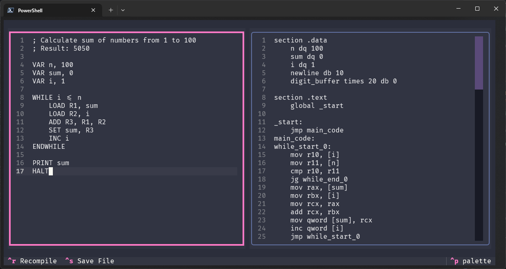
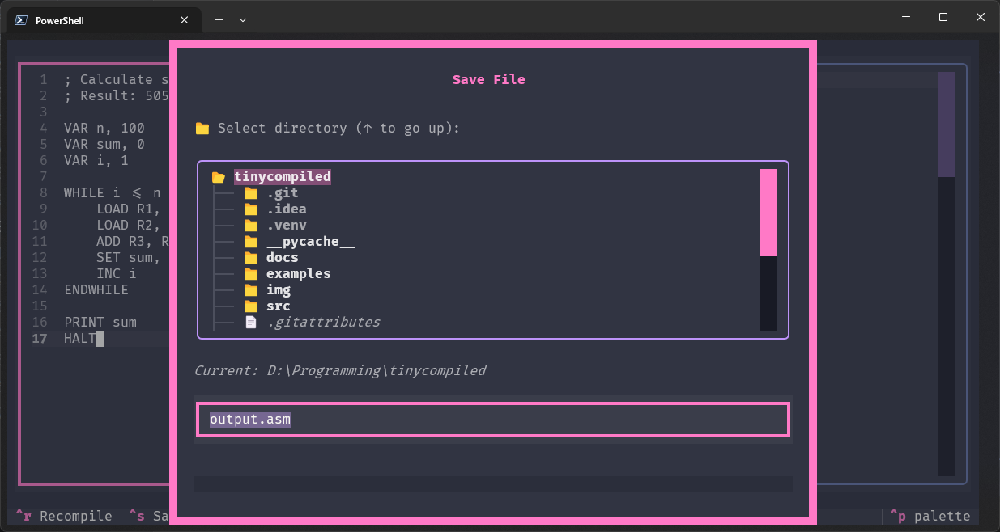
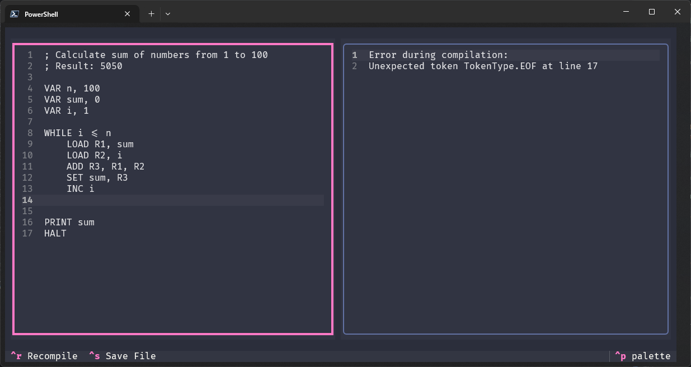
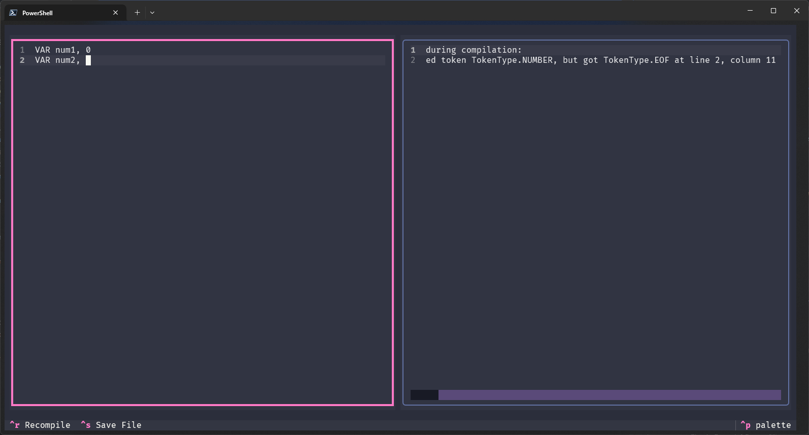

# TinyCompiled

## **A Small Educational Compiler and Visualizer for Assembly Language Learning**

### **Authors:** Denys Shevchenko, Yehor Karabanov



TinyCompiled is a small educational compiler and visualizer for a custom assembly-like language designed to help new
developers understand the fundamentals of low-level programming, assembly language, and compilation. The project focuses
on demonstrating how high-level instructions are translated into assembly code, providing an intuitive and interactive
experience for learning and experimentation.

## 📖 Overview

TinyCompiled takes programs written in **TinyCompiled** (`.tc` files) — a simplified, human-readable assembly-like
language — and translates them into real **x86-64 NASM assembly**, allowing users to see exactly how each instruction
maps to low-level operations. By combining compilation with visualization, TinyCompiled bridges the gap between abstract
programming concepts and the underlying machine instructions, making it a powerful tool for students, educators, and
hobbyists.

## ✨ Key Features

### 🔄 TinyCompiled (.tc) → NASM Translation

TinyCompiled converts TinyCompiled instructions into NASM assembly line by line, including:

- Arithmetic operations (ADD, SUB, MUL, DIV)
- Logical/bitwise operations (AND, OR, XOR, NOT, SHL, SHR)
- Data movement (LOAD, SET, MOVE)
- Control flow (IF/ELSE, WHILE, FOR, LOOP, REPEAT/UNTIL)
- Functions (FUNC, CALL, RET)
- Input/output (PRINT, INPUT)
- Stack operations (PUSH, POP)
- Special instructions (HALT, NOP)

Each translation preserves the logical structure of the program, making it easy to follow and understand how high-level
logic is implemented in assembly.

### 📊 Side-by-Side Visualization

Using the **Textualize/Textual** Python library, TinyCompiled displays TinyCompiled code alongside its NASM translation
in a diff-style table. This visualization allows users to clearly see the mapping between abstract instructions and real
machine operations, highlighting the effect of each line in an interactive terminal interface.

### 🖥️ GUI Interface

The graphical interface provides:

- Real-time code editor for TinyCompiled
- Live compilation and preview of NASM output
- File save/load functionality
- Interactive terminal-based UI using Textual

### 📝 Language Features

TinyCompiled supports:

- **8 virtual registers**: R1-R8 (mapped to x86-64 registers)
- **Variables**: User-defined identifiers with optional initialization
- **Functions**: Named subroutines with parameters and return values
- **Control structures**: Loops, conditionals, and branching
- **I/O operations**: Print integers, read integers from stdin
- **Comments**: Semicolon-prefixed single-line comments
- **Literals**: Decimal, hexadecimal (0x), and binary (0b) numbers

## 🏗️ Architecture

### 🔄 Compilation Pipeline

TinyCompiled follows a traditional compiler architecture:

1. **Lexical Analysis** (`src/lexer/`): Tokenizes source code into keywords, identifiers, numbers, and operators
2. **Syntax Analysis** (`src/parser/`): Parses tokens into an Abstract Syntax Tree (AST)
3. **Code Generation** (`src/generator/`): Translates AST into NASM x86-64 assembly code

### 🎯 Virtual Registers

TinyCompiled provides 8 virtual registers that map to x86-64 registers:

- R1 → rax (accumulator)
- R2 → rbx (base)
- R3 → rcx (counter)
- R4 → rdx (data)
- R5 → rsi (source index)
- R6 → rdi (destination index)
- R7 → r8
- R8 → r9

### 💾 Memory Model

- **Variables**: Stored in the `.data` section with labels
- **Stack**: Used for function calls and local variables
- **Heap**: Not directly supported (assembly-level memory management)

## 💡 Example

Here's a simple example demonstrating TinyCompiled syntax:

```assembly
; Calculate sum of numbers from 1 to 100
; Result: 5050

VAR n, 100
VAR sum, 0
VAR i, 1

WHILE i <= n
    LOAD R1, sum
    LOAD R2, i
    ADD R3, R1, R2
    SET sum, R3
    INC i
ENDWHILE

PRINT sum
HALT
```

**Run it:**

```bash
uv run cli.py run examples/sum.tc
# Output: 5050
```

**More Examples:**

Check the [`examples/`](examples/) directory for more demonstrations including:

- `fibonacci.tc` - Fibonacci sequence with functions
- `prime_check.tc` - Prime number checker
- `calculator.tc` - Interactive calculator
- `for_loop_demo.tc` - FOR loop variations
- `bitwise_demo.tc` - Bitwise operations
- And more!

## 📦 Installation

### ⚙️ Prerequisites

Before installing TinyCompiled, you need to install the following dependencies:

- **UV Package Manager** - [Install UV](https://docs.astral.sh/uv/getting-started/installation/)
- **NASM Assembler** (required for building/running programs) - [Install NASM](https://www.nasm.us/)
- **Linker (ld)** - Usually pre-installed on Linux/macOS. Windows users need WSL for the full build pipeline.

### 🔧 Install from Source

```bash
git clone https://github.com/LilConsul/tinycompiled.git
cd tinycompiled
uv sync
```

This will install all Python dependencies and set up the virtual environment.

## 🚀 Usage

### 💻 CLI Usage

Run TinyCompiled commands using `uv run`:

**Compile to NASM Assembly:**

```bash
uv run cli.py compile examples/sum.tc output.asm
```

Or output to stdout:

```bash
uv run cli.py compile examples/sum.tc
```

**Build Executable (Linux/macOS):**

```bash
uv run cli.py build examples/sum.tc sum_program
```

**Compile and Run:**

```bash
uv run cli.py run examples/sum.tc
```

**Verbose Output:**

```bash
uv run cli.py compile examples/fibonacci.tc --verbose
```

**Debug Mode (shows tokens and AST):**

```bash
uv run cli.py compile examples/fibonacci.tc --debug
```

### 🖥️ GUI Usage

Launch the interactive GUI editor:

```bash
uv run gui.py
```


This launches the interactive Textual-based editor where you can:

- Write TinyCompiled code in the left pane
- Ctrl+R - See real-time NASM translation in the right pane
- Ctrl+S - Save files (shows file save dialog)
- Ctrl+Q - Quit the application

#### ⚡ GUI Features

**File Save Dialog:**



**Error Reporting:**

The GUI provides helpful error messages with line numbers and context:





### 📝 Language Syntax

See [`docs/`](docs/DOCUMENTATION.md) for complete language reference.

### 📋 Quick Reference

**Registers:** R1-R8 (mapped to x86-64 registers: rax, rbx, rcx, rdx, rsi, rdi, r8, r9)

**Variables:**

```assembly
VAR name, value    ; Declare and initialize
VAR count          ; Declare without initialization
```

**Arithmetic:**

```assembly
ADD R1, R2, R3     ; R1 = R2 + R3
SUB R1, R2, R3     ; R1 = R2 - R3
MUL R1, R2, R3     ; R1 = R2 * R3
DIV R1, R2, R3     ; R1 = R2 / R3
INC var            ; var++
DEC var            ; var--
```

**Bitwise Operations:**

```assembly
AND R1, R2, R3     ; R1 = R2 & R3
OR R1, R2, R3      ; R1 = R2 | R3
XOR R1, R2, R3     ; R1 = R2 ^ R3
NOT R1, R2         ; R1 = ~R2
SHL R1, R2, 2      ; R1 = R2 << 2
SHR R1, R2, 2      ; R1 = R2 >> 2
```

**Data Movement:**

```assembly
LOAD R1, var       ; Load variable into register
SET var, R1        ; Store register into variable
MOVE R1, R2        ; Copy R2 to R1
```

**Control Flow:**

```assembly
IF condition
    ; code
ELSE
    ; code
ENDIF

WHILE condition
    ; code
ENDWHILE

FOR var FROM start TO end
    ; code
ENDFOR

FOR var FROM start TO end STEP increment
    ; code
ENDFOR

LOOP count
    ; code
ENDLOOP

REPEAT
    ; code
UNTIL condition
```

**Functions:**

```assembly
FUNC function_name
    ; function body
    RET register
ENDFUNC

CALL function_name
```

**I/O:**

```assembly
PRINT register     ; Print integer value
INPUT variable     ; Read integer from stdin
```

**Stack:**

```assembly
PUSH register
POP register
```

**Other:**

```assembly
HALT              ; Exit program
NOP               ; No operation
; comment         ; Single-line comment
```

## 🏗️ Architecture

TinyCompiled is organized into modular components that reflect the typical stages of a compiler:

- **Lexer**: Tokenizes the input `.tc` source files into a stream of tokens.
- **Parser**: Analyzes the token stream and builds an Abstract Syntax Tree (AST).
- **AST**: Represents the program structure in a tree format for further processing.
- **Code Generator**: Converts the intermediate representation of AST into x86-64 NASM assembly code.
- **Compiler**: Coordinates the general compilation pipeline.
- **Visualizer/GUI**: Provides an interactive interface for users to write, compile, and visualize code execution.
  Each component is organized in its own subdirectory within `src/`, promoting separation of concerns and ease of
  maintenance.
  For a complete language reference and further architectural details, see [
  `docs/DOCUMENTATION.md`](docs/DOCUMENTATION.md).

## 📁 Project Structure

```
tinycompiled/
├── src/
│   ├── __init__.py
│   ├── compiler/
│   │   ├── compiler.py      # Main compilation pipeline
│   │   └── __init__.py
│   ├── lexer/
│   │   ├── lexer.py         # Lexical analyzer
│   │   ├── token.py         # Token definitions
│   │   ├── keyword.py       # Language keywords
│   │   └── __init__.py
│   ├── parser/
│   │   ├── parser.py        # Syntax analyzer
│   │   └── __init__.py
│   ├── ast/
│   │   ├── node.py          # AST node definitions
│   │   └── __init__.py
│   └── generator/
│       ├── nasm_generator.py # NASM code generator
│       └── __init__.py
├── examples/
│   ├── fibonacci.tc         # Fibonacci function example
│   └── ...
├── docs/
│   ├── DOCUMENTATION.md     # Language reference
│   └── USAGE.md             # Usage examples
├── cli.py                   # Command-line interface
├── gui.py                   # GUI application
└── pyproject.toml           # Project configuration
```

## 🎯 Project Goals

- **Educational Focus**: Help beginners understand assembly language and low-level programming concepts
- **Interactive Learning**: Provide real-time visualization of code translation
- **Accessibility**: Make assembly language learning approachable and engaging
- **Practical Knowledge**: Bridge the gap between high-level and low-level programming

## 📄 License

This project is provided for educational purposes. Please refer to the repository for specific licensing information.

## 🔗 References

- [GitHub Repository](https://github.com/LilConsul/tinycompiled)
- [NASM Assembler Documentation](https://www.nasm.us/docs.html)
- [Textual Framework Documentation](https://textual.textualize.io/)
